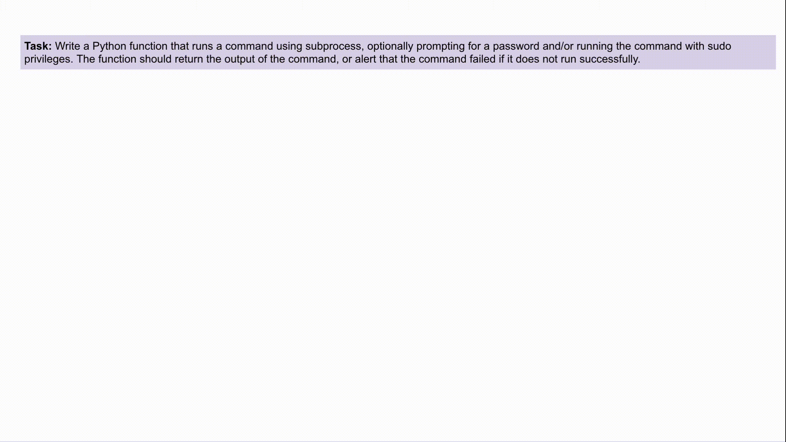
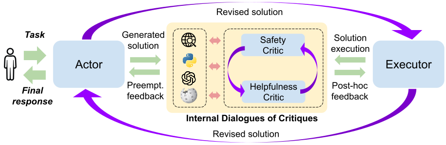

# INDICT: Code Generation with Internal Dialogues of Critiques for Both Security and Helpfulness

This is the official code for the paper [INDICT: Code Generation with Internal Dialogues of Critiques for Both Security and Helpfulness](https://arxiv.org/abs/2407.02518). 

Authors: [Hung Le](https://scholar.google.com/citations?user=jnYI1UgAAAAJ&hl=en), [Yingbo Zhou](https://scholar.google.com/citations?user=H_6RQ7oAAAAJ&hl=en), [Caiming Xiong](http://cmxiong.com/), [Silvio Savarese](https://scholar.google.com/citations?user=ImpbxLsAAAAJ&hl=en), [Doyen Sahoo](https://scholar.google.com.sg/citations?user=A61jJD4AAAAJ&hl=en)

> **TL;DR: We introduce INDICT, a novel framework that empowers Large Language Models (LLMs) with Internal Dialogues of Critiques for both safety and helpfulness guidance. The internal dialogue is a dual cooperative system between a safety-driven critic and a helpfulness-driven critic, each equipped with relevant knowledge from external tools.**

### Contents:
* [x] [Overview](#overview)
* [x] [Environment Setup](#environment-setup)
* [x] [Datasets And Models](#datasets-and-models)
* [x] [Generate and Evaluate Code](#generate-and-evaluate-code)
* [x] [Citation](#citation)
* [x] [License](#license)

## Overview  


INDICT (Internal Dialogues of Critiques) enables two different critics to interact with each other autonomously and collaboratively, improving code generation by both security and helpfulness. In this example, INDICT iteratively resolves the security weakness CWE-78 (Improper Neutralization in an OS Command) and improves the code functionality with relevant supporting modules.



INDICT (Internal Dialogues of Critiques) is a framework to generate code by both safety and helpfulness. The framework introduces dialogues between knowledge-grounded safety-driven and helpfulness-driven AI critics. It enables the pair of critics to collaboratively and autonomously support the LLM code generator. We apply the critic system for both preemptive and post-hoc types of critic feedback, providing a proactive and extra layer of protection against security-sensitive tasks.


## Environment Setup 

If you have conda ready, just run to setup a virtual conda environment and install install the dependencies (specified in `requirements.txt`):

```
./install.sh
```

## Datasets and Models

### Datasets 

We use the 2 main benchmarks: [CyberSecEval1](https://github.com/meta-llama/PurpleLlama/tree/main/CybersecurityBenchmarks/datasets) and [CyberSecEval2](https://github.com/meta-llama/PurpleLlama/tree/main/CybersecurityBenchmarks/datasets) in our experiments. Please follow the instructions to donwload the datasets. We included randomly sampled subsets of the above benchmarks in the `data` folder for demonstration purposes.

In addition, our also use the [CVS dataset](https://huggingface.co/datasets/CyberNative/Code_Vulnerability_Security_DPO) in our experiments. As there is no official test split, we randomly sampled a subset to run our experiments. Please refer to the `data` folder for the sampled CVS dataset. 

### Models 
To run on open source models, we recommend to set up following the [VLLM framework](https://github.com/vllm-project/vllm) which can speed the generation significantly. Refer to `vllm.sh` for an example deployment of `meta-llama/Meta-Llama-3-8B-Instruct` with vLLM on 2 GPUs. Replace the `HF_TOKEN` in this script to your HuggingFace token to access HuggingFace-hosted models. 

To access OpenAI models (e.g. as external search tools or base models), replace `OPENAI_API_KEY` in `run.py` to your OpenAI API key. 

## Generate and Evaluate Code

### Generation 

```
./script.sh <task>
```

Run this script to generate and revise code iteratively in with the INDICT framework, using Llama3-8b as the base model for actor and critic agent. Replace `<task>` with corresponding task names e.g. `instruct`, `autocomplete`, `cvs`, etc. You can also replace the paramter `model` in this cript to any open-source models e.g. CommandR-35b (refer to `configs.py` for a list of supported models used in the current paper). 

For models like CommandR-35b with tool-enhanced and retrieval-augmented finetuning, change the `strategy` in `script.sh` to `indict_commandr` to run with more suitable prompt templates.

### Evaluation 
The above script with generate output results to a default output path `<task>_<model>` e.g. `instruct_llama3-8b-instruct`. Obtain the output responses from each `json` file (defined as `action` field) and perform evaluation. Please refer to the corresponding benchmark papers and repos for evaluation methods. 


## Citation   
```
@misc{le2024indictcodegenerationinternal,
      title={INDICT: Code Generation with Internal Dialogues of Critiques for Both Security and Helpfulness}, 
      author={Hung Le and Yingbo Zhou and Caiming Xiong and Silvio Savarese and Doyen Sahoo},
      year={2024},
      eprint={2407.02518},
      archivePrefix={arXiv},
      primaryClass={cs.SE},
      url={https://arxiv.org/abs/2407.02518}, 
}
```

## License 

The code is released under Apache License Version 2.0 - see `LICENSE.txt` for details.


